# Flutter Portfolio 준비하기

## 2. PhoneBook

</br>

간단한 CRUD 처리를 위한 RESTful 방식의 Spring 서버구현

- SpringBoot
- JPA
- H2 데이터베이스 사용
- GetX 라이브러리 사용 (상태관리)

</br>

### API 문서

```
1. 공통코드
code : 1  (통신 정상)
code : -1  (통신 실패)

2. 번호 등록
요청 주소 (POST)
- http://localhost:8080/item
요청 파라미터
- application/json
{
    "name" : "홍길동",
    "tel" : "010-1234-5678"
}

응답 바디
- application/json
{
    "code" : 1,
    "msg" : "저장 완료",
    "data" : {
        "id" : 1,
        "name" : "홍길동",
        "tel" : "010-1234-5678"
    }
}

3. 번호 전체찾기
요청 주소 (GET)
- http://localhost:8080/item

응답 바디
- application/json
{
    "code" : 1,
    "msg" : "전체찾기 성공",
    "data" : [
        {
        "id" : 1,
        "name" : "홍길동",
        "tel" : "010-1234-5678"
        }
    ]
}

4. 번호 한건찾기
요청 주소 (GET)
- http://localhost:8080/item/1

응답 바디
- application/json
{
    "code" : 1,
    "msg" : "상세보기 완료",
    "data" : {
        "id" : 1,
        "name" : "홍길동",
        "tel" : "010-1234-5678"
    }
}

5. 번호 수정하기
요청 주소 (PUT)
- http://localhost:8080/item/1
요청 파라미터
- application/json
{
    "name" : "길동무",
    "tel" : "010-1234-1234"
}

응답 바디
- application/json
{
    "code" : 1,
    "msg" : "수정 완료",
    "data" : {
        "id" : 1,
        "name" : "길동무",
        "tel" : "010-1234-1234"
    }
}

6. 번호 삭제하기
요청 주소 (DELETE)
- http://localhost:8080/item/1

응답 바디
- application/json
{
    "code" : 1,
    "msg" : "삭제 완료",
    "data" : null
}

```

### 번호 등록

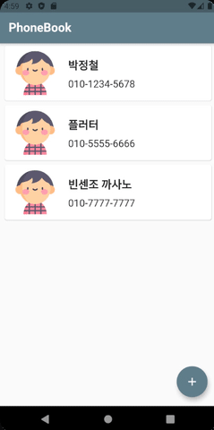</img>

</br>

### 번호 수정

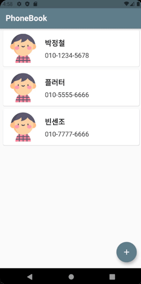</img>

</br>

### 번호 삭제

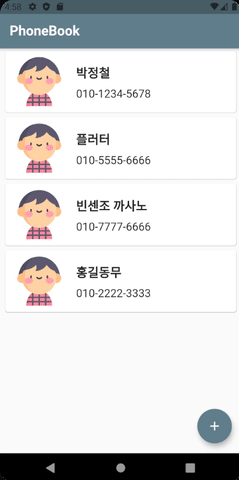</img>

</br>

### 풀버전

</img>

</br>

</br>

## 1. 이상형 월드컵

</br>

내부 스토리지로 그냥 간단한 이상형 월드컵 만들어 보는 중.

</br>
</br>

### 시작 Intro

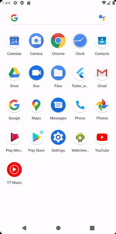</img>
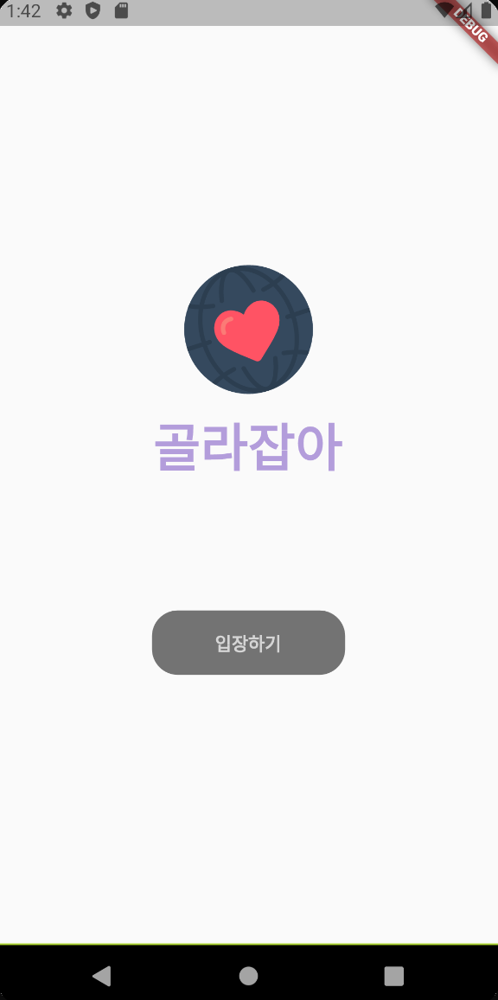</img>

</br>

### 메인 화면

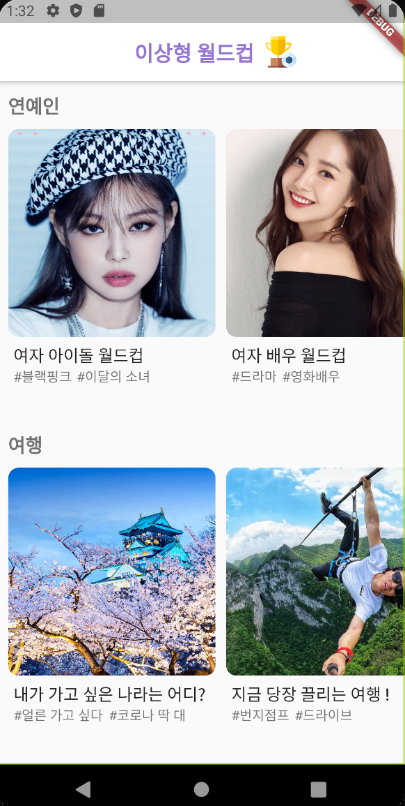</img>
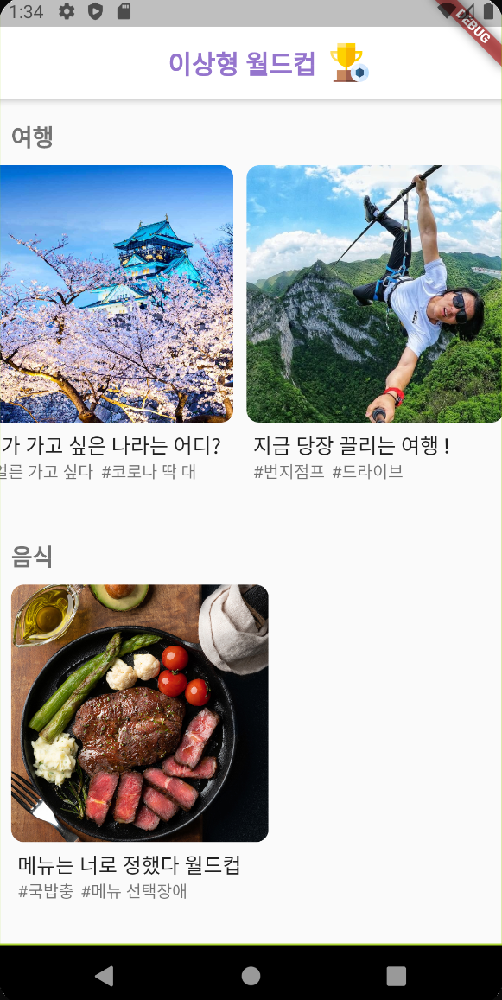</img>
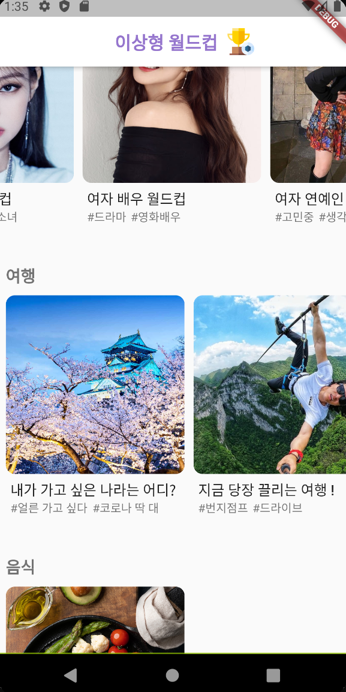</img>

</img>

</br>

### 선택 화면

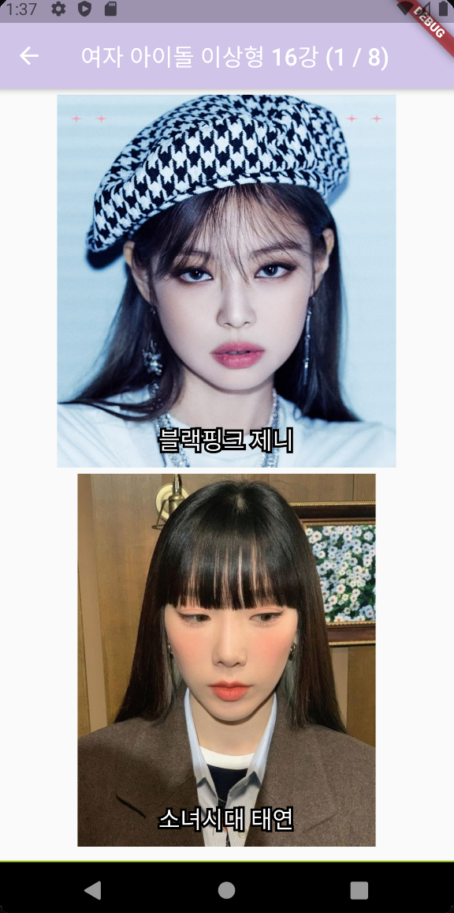</img>
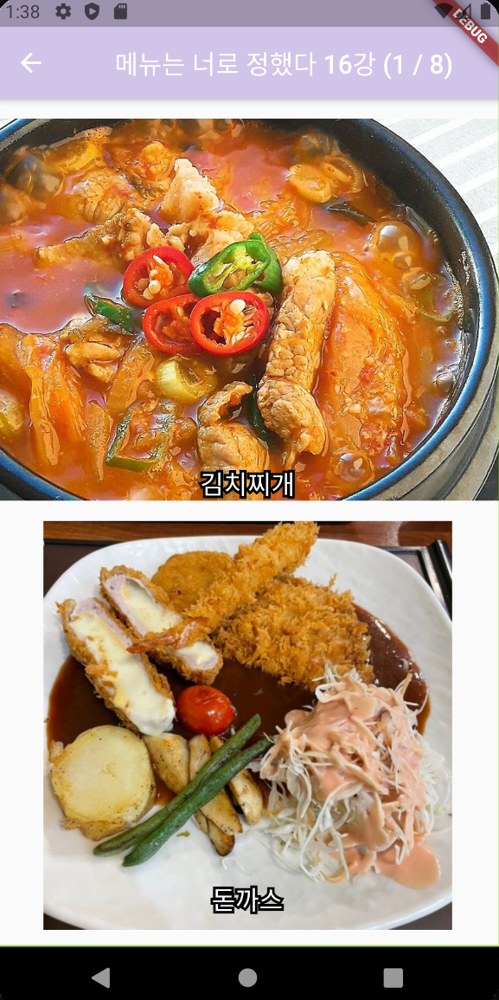</img>

</br>

### 우승 화면

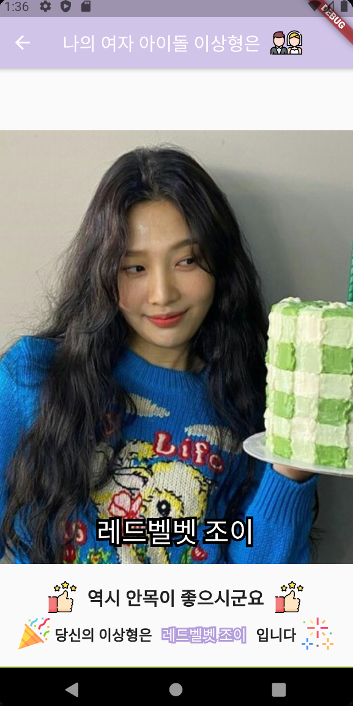</img>
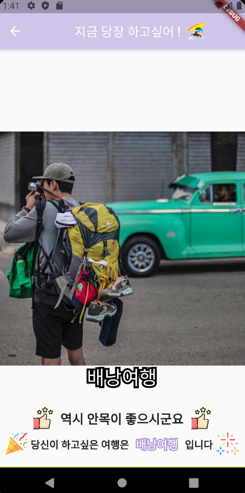</img>

</br>

### 카테고리 별 화면

</br>

#### 여자 아이돌 월드컵

</img>

</br>  
</br>

#### 여자 배우 월드컵

</img>

</br>  
</br>

#### 가고 싶은 나라 월드컵

</img>

</br>  
</br>

#### 하고 싶은 여행 월드컵

</img>

</br>  
</br>

#### 메뉴 선정 월드컵

## </img>
